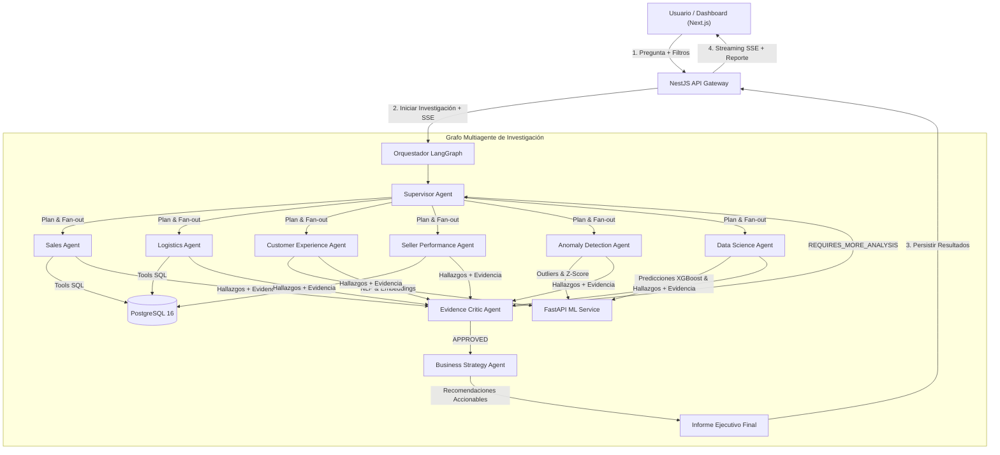

# CommerceOps AI 🚀
## Plataforma Multiagente para Análisis Operacional de E-Commerce

> **Proyecto de portafolio basado en el dataset público Brazilian E-Commerce Public Dataset by Olist de Kaggle (~100.000 pedidos).**

CommerceOps AI coordina un equipo de **9 agentes especializados** en ventas, logística, experiencia de cliente, rendimiento de vendedores, detección de anomalías, machine learning y estrategia empresarial. Un **Evidence Critic** audita y valida todas las evidencias numéricas antes de generar el informe final.

---

## 🌟 Características Principales

- **Orquestación Multiagente Real:** Grafo de ejecuciones paralelas coordinado con **LangGraph JS** y **NestJS**.
- **Herramientas Deterministas:** Principio estricto: *los agentes razonan, las herramientas calculan*. Todas las métricas provienen de consultas SQL y modelos ML.
- **Streaming SSE en Tiempo Real:** Visualización en vivo del progreso de cada agente y ejecuciones de herramientas mediante Server-Sent Events.
- **Análisis Semántico y NLP:** Procesamiento de reseñas de clientes en portugués brasileño mediante modelo multilingüe (`paraphrase-multilingual-MiniLM-L12-v2`).
- **Machine Learning Explicable:** Modelos predictivos XGBoost con explicación de importancia de características mediante SHAP.
- **Evaluación Comparativa:** Suite de benchmarks que demuestra cuantitativamente que la arquitectura multiagente supera a un agente único en precisión y confiabilidad.
- **Frontend Dashboard:** Interfaz moderna desarrollada con Next.js (App Router) y CSS Vanilla (Design System con CSS Custom Properties).

---

## 🏗️ Arquitectura y Flujo de Trabajo Multiagente



### 🔄 Flujo de Ejecución de una Investigación (Paso a Paso)

1. **Recepción y Planificación (`SUPERVISOR`)**:
   - Recibe la pregunta del usuario en lenguaje natural y aplica filtros (rango de fechas, categorías, estados).
   - Consulta `get_dataset_coverage` y `resolve_business_entities` para validar la disponibilidad de datos.
   - Descompone la consulta en subtareas y selecciona únicamente a los agentes especialistas requeridos (ej. `LOGISTICS` + `CUSTOMER_EXPERIENCE`).

2. **Ejecución Paralela & Cálculo Determinista (Especialistas)**:
   - Los agentes seleccionados se ejecutan en **paralelo** utilizando sus herramientas deterministas.
   - **Principio:** El LLM razona la estrategia, pero la herramienta calcula los números (vía SQL contra PostgreSQL o FastAPI para ML/NLP).
   - Cada agente genera **Hallazgos (*Findings*)** vinculados a **Evidencias (*Evidence*)** numéricas o estadísticas.

3. **Auditoría Crítica & Control de Alucinaciones (`CRITIC`)**:
   - El **Evidence Critic** analiza los hallazgos generados.
   - Verifica la relación 1:1 entre cada cifra afirmada y la evidencia SQL/ML registrada.
   - Modera afirmaciones causales no justificadas y detecta contradicciones.
   - Si la evidencia es insuficiente, fuerza un bucle de re-evaluación (`REQUIRES_MORE_ANALYSIS`). Si la evidencia es sólida, emite `APPROVED`.

4. **Traducción Estratégica (`STRATEGY`)**:
   - Consolida los hallazgos aprobados por el crítico.
   - Transforma datos técnicos en **Recomendaciones Empresariales Accionables** priorizadas (`CRITICAL`, `HIGH`, `MEDIUM`, `LOW`), indicando supuestos e impacto de negocio estimado.

5. **Consolidación & Streaming SSE**:
   - La API NestJS compila el informe final, lo persiste en PostgreSQL y emite eventos en tiempo real mediante **Server-Sent Events (SSE)** hacia la interfaz gráfica de Next.js.

---

### 🤖 Catálogo de Agentes Especializados

| Agente | Nombre | Rol y Responsabilidades en el Sistema | Herramientas Principales |
|---|---|---|---|
| 👑 **Operations Supervisor** | `SUPERVISOR` | Orquestador principal. Analiza la consulta inicial, mapea entidades y construye el plan de trabajo fan-out. | `get_dataset_coverage`, `resolve_business_entities` |
| 📊 **Sales Intelligence** | `SALES` | Analiza ingresos, volumen de pedidos, ticket promedio, métodos de pago y concentración de ventas por categoría. | `get_revenue_summary`, `get_sales_by_category` |
| 🚚 **Logistics Agent** | `LOGISTICS` | Investiga tasas de retraso en entregas, tiempos de transporte por carrier, tiempos de preparación del vendedor y SLAs por región. | `get_delivery_summary`, `compare_delivery_periods` |
| ⭐ **Customer Experience** | `CUSTOMER_EXPERIENCE` | Analiza calificaciones (1-5 estrellas), sentimiento y búsqueda semántica sobre reseñas en portugués mediante embeddings. | `get_rating_summary`, `search_reviews_semantic` |
| 🏪 **Seller Performance** | `SELLER_PERFORMANCE` | Genera scorecards operacionales por vendedor, identifica vendedores de alto riesgo y compara métricas contra pares. | `get_seller_scorecard`, `rank_sellers_by_risk` |
| 🚨 **Anomaly Detection** | `ANOMALY` | Aplica Z-Score robusto e Isolation Forest para detectar desviaciones atípicas en costos de flete, ventas o picos de reclamos. | `detect_metric_anomalies`, `detect_freight_outliers` |
| 🧪 **Data Science Agent** | `DATA_SCIENCE` | Modela y predice riesgos operacionales con algoritmos XGBoost, entregando explicación de importancia de variables con SHAP. | `predict_delivery_delay`, `explain_prediction` |
| ⚖️ **Evidence Critic** | `CRITIC` | Audita que ninguna cifra sea inventada por el LLM. Valida consistencia entre evidencias SQL y afirmaciones de los agentes. | `validate_finding_evidence`, `check_causal_language` |
| 💡 **Business Strategy** | `STRATEGY` | Traduce los hallazgos validados en plan de acción operativo con prioridades, supuestos e impacto esperado. | `prioritize_recommendations`, `estimate_historical_impact` |

---

## 🛠️ Stack Tecnológico

- **Backend Gateway:** NestJS (TypeScript, Nest CLI 11, Swagger, RxJS)
- **Multiagent Orchestration:** LangGraph JS, LangChain Core, OpenAI GPT-4o / GPT-4o-mini
- **Base de Datos & ORM:** PostgreSQL 16, Prisma ORM 5.22
- **ML & NLP Service:** Python 3.11, FastAPI, XGBoost, SHAP, Sentence-Transformers
- **Frontend App:** Next.js 16, React 19, CSS Vanilla, Recharts
- **Monorepo & Build:** Turborepo, Docker Compose

---

## 📂 Estructura del Monorepo

```text
commerceOpsAi/
├── apps/
│   ├── api/                    ← NestJS Gateway & LangGraph Orchestrator (Puerto 3001)
│   ├── web/                    ← Next.js Frontend Dashboard (Puerto 3000)
│   └── ml-service/             ← FastAPI Python ML & NLP Service (Puerto 8000)
├── packages/
│   ├── shared-types/           ← Tipos e interfaces TypeScript compartidas
│   ├── agent-contracts/        ← Contratos, herramientas y permisos de agentes
│   ├── evaluation/             ← Framework de benchmarks y métricas de alucinación
│   └── observability/          ← Logger, métricas de ejecución y costo
├── data/
│   ├── raw/                    ← Dataset Olist CSV (9 archivos ya incluidos)
│   ├── fixtures/               ← Subconjuntos de prueba (~1000 pedidos)
│   └── models/                 ← Modelos ML serializados
├── prisma/
│   └── schema.prisma           ← Esquema de base de datos relacional
├── scripts/
│   ├── validate-dataset.py     ← Script de validación de integridad del dataset
│   ├── import-olist.ts         ← Importación masiva de alta velocidad a PostgreSQL
│   ├── create-fixtures.ts      ← Generador de subconjuntos de prueba
│   └── seed-evaluations.ts     ← Runner de suite de benchmarks comparativos
├── docs/                       ← Documentación de arquitectura, agentes y demos
├── docker-compose.yml
├── turbo.json
└── package.json
```

---

## 🚀 Instalación y Ejecución Local

### Prerrequisitos
- Node.js >= 20.x
- Python >= 3.11
- Docker Desktop

---

### 1. Configurar Variables de Entorno
Copia el archivo `.env.example` a `.env` en la raíz y dentro de la carpeta `prisma/`:
```bash
# En Windows PowerShell:
Copy-Item .env.example .env
Copy-Item prisma/.env.example prisma/.env
```
*(Ajusta tu `OPENAI_API_KEY` en el `.env` creado).*

---

### 2. Iniciar PostgreSQL y Redis con Docker
> ⚠️ **Importante:** Asegúrate de tener Docker corriendo antes de este paso.
```bash
docker-compose up -d postgres redis
```
*(Esto levantará PostgreSQL 16 en el puerto `5434` y Redis en el puerto `6379`)*.

---

### 3. Ejecutar Migraciones de Base de Datos e Importar Dataset
```bash
# Generar Cliente Prisma
npm run db:generate

# Aplicar migraciones iniciales a PostgreSQL
npm run db:migrate

# Poblar la base de datos con el dataset Olist (99.441 pedidos)
npm run db:seed
```

---

### 4. Iniciar la Aplicación en Modo Desarrollo
```bash
npm run dev
```

> 🌐 **¿DÓNDE ACCEDER EN EL NAVEGADOR?**
>
> 💻 **1. INTERFAZ WEB GRAFICA (FRONTEND):** **[http://localhost:3000](http://localhost:3000)**
> *👉 Abre esta dirección para ver el Dashboard interactivo, tarjetas de KPI y ejecutar investigaciones gráficas.*
>
> 📚 **2. DOCUMENTACIÓN SWAGGER DE LA API (BACKEND):** **[http://localhost:3001/api/docs](http://localhost:3001/api/docs)**
> *👉 Abre esta dirección para explorar e interactuar con los endpoints REST.*
>
> ⚙️ **3. ESTADO DE SALUD DEL BACKEND GATEWAY (JSON):** **[http://localhost:3001/api](http://localhost:3001/api)**
>
> *(Nota: El comando `npm run dev` inicia mediante Turborepo tanto el Frontend en el puerto `3000` como la API Backend en el puerto `3001` de forma simultánea).*

---

## 💡 Preguntas de Ejemplo para Probar el Sistema

Si estás evaluando este proyecto de portafolio, puedes copiar y probar cualquiera de las siguientes preguntas reales en el Dashboard (`http://localhost:3000/investigations`) o enviarlas a través del API REST (`POST /api/investigations`). 

Cada consulta activa dinámicamente una combinación diferente de agentes especialistas, ejecuta consultas deterministas en PostgreSQL/ML y genera recomendaciones accionables.

---

### 🚚 1. Logística y SLA de Entregas
> **Pregunta 1:** `¿Por qué aumentaron las entregas tardías en la categoría muebles durante febrero de 2018?`
- **Agentes Invocados:** `LOGISTICS`, `SELLER_PERFORMANCE`, `ANOMALY`, `CRITIC`, `STRATEGY`
- **Lo que evalúa:** Mide el impacto del tiempo de preparación del vendedor frente al tiempo en tránsito de transportistas en la categoría muebles.
- **Resultado Esperado:** Detección de picos en la tasa de atrasos y clasificación de cuellos de botella por estado.

> **Pregunta 2:** `¿Cuáles son las 3 rutas interestatales con mayor tasa de atrasos en entregas?`
- **Agentes Invocados:** `LOGISTICS`, `ANOMALY`, `CRITIC`
- **Lo que evalúa:** Comparativa regional de SLAs de entrega por origen (vendedor) y destino (cliente).

---

### ⭐ 2. Satisfacción del Cliente y Experiencia (CX)
> **Pregunta 3:** `¿Por qué disminuyó la calificación promedio de los clientes en febrero de 2018?`
- **Agentes Invocados:** `CUSTOMER_EXPERIENCE`, `LOGISTICS`, `SALES`, `CRITIC`, `STRATEGY`
- **Lo que evalúa:** Correlación entre la caída en estrellas (1-5) y el incremento de demoras logísticas.
- **Resultado Esperado:** Búsqueda semántica sobre comentarios en portugués y hallazgos con nivel de confianza.

> **Pregunta 4:** `¿Cuáles son las quejas principales en las reseñas de 1 estrella sobre la categoría informatica_acessorios?`
- **Agentes Invocados:** `CUSTOMER_EXPERIENCE`, `CRITIC`
- **Lo que evalúa:** Clustering NLP y clasificación de temas sobre reseñas con bajas calificaciones.

---

### 📊 3. Ventas, Facturación y Métodos de Pago
> **Pregunta 5:** `¿Cuáles son las 5 categorías que concentran mayores ingresos y cómo varió su ticket promedio?`
- **Agentes Invocados:** `SALES`, `CRITIC`
- **Lo que evalúa:** Agregaciones financieras directas en SQL para identificar las categorías más rentables del marketplace.

> **Pregunta 6:** `¿Cuál es la diferencia en volumen de ventas e ingresos entre pagos con tarjeta de crédito y boleto bancario?`
- **Agentes Invocados:** `SALES`, `CRITIC`
- **Lo que evalúa:** Análisis de distribución de métodos de pago y cantidad de cuotas.

---

### 🏪 4. Evaluación de Riesgo de Vendedores
> **Pregunta 7:** `Evalúa el riesgo operacional y rendimiento acumulado del vendedor con mayores ventas.`
- **Agentes Invocados:** `SELLER_PERFORMANCE`, `LOGISTICS`, `CUSTOMER_EXPERIENCE`, `STRATEGY`
- **Lo que evalúa:** Generación de scorecard de vendedor (tasa de entregas a tiempo, facturación total, rating promedio) y clasificación de riesgo (`HIGH` / `LOW`).

---

### 🧪 5. Detección de Anomalías y Machine Learning
> **Pregunta 8:** `¿Qué rutas interestatales tienen mayor probabilidad de sufrir un retraso según el modelo predictivo?`
- **Agentes Invocados:** `DATA_SCIENCE`, `LOGISTICS`, `STRATEGY`
- **Lo que evalúa:** Ejemplo de inferencia predictiva con algoritmo XGBoost y desglose de importancia de características con SHAP.

> **Pregunta 9:** `Detecta desviaciones o picos anómalos en el costo de flete en comparación con el precio del producto.`
- **Agentes Invocados:** `ANOMALY`, `LOGISTICS`, `CRITIC`
- **Lo que evalúa:** Aplicación de Z-Score robusto para señalar publicaciones u órdenes con fletes desproporcionados.

---

## 🧪 Evaluaciones Comparativas

Para ejecutar la suite de evaluación y verificar la precisión del enfoque multiagente frente a single-agent:

```bash
npx ts-node --transpile-only -O '{"module":"commonjs"}' scripts/seed-evaluations.ts
```

Consulte [docs/evaluation.md](docs/evaluation.md) para ver los resultados detallados del benchmark.

---

## 📄 Licencia y Atribución
Este proyecto utiliza el dataset público **Brazilian E-Commerce Public Dataset by Olist** publicado en Kaggle bajo Licencia CC BY-NC-SA 4.0.
