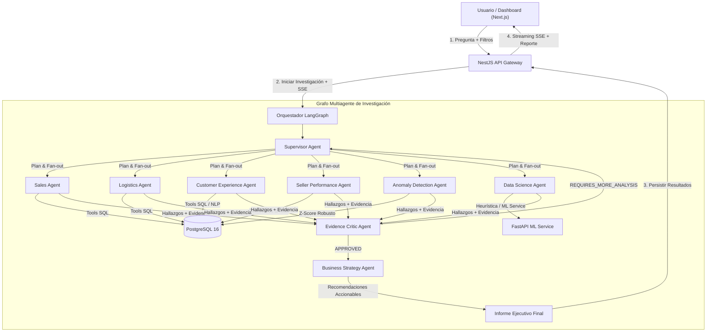

# CommerceOps AI 🚀
## Plataforma Multiagente para Análisis Operacional de E-Commerce

> **Proyecto de portafolio basado en el dataset público Brazilian E-Commerce Public Dataset by Olist de Kaggle (~100.000 pedidos).**

CommerceOps AI coordina un equipo de **agentes especializados** en ventas, logística, experiencia de cliente, rendimiento de vendedores, detección de anomalías, machine learning y estrategia empresarial. Un **Evidence Critic** audita y evalúa la evidencia numérica antes de generar el informe final.

---

## 📌 Estado del Proyecto (MVP)

Este repositorio es un **MVP en desarrollo activo** de una plataforma multiagente para inteligencia operacional de e-commerce.

### ✅ Implementado
- **Orquestación Multiagente Real:** Grafo de ejecuciones paralelas coordinado con **LangGraph JS** y **NestJS** (`StateGraph` con `Send`).
- **Agentes Especialistas Operativos:** Supervisor, Sales, Logistics, Customer Experience, Seller Performance, Anomaly, Data Science, Evidence Critic y Business Strategy.
- **Herramientas Deterministas:** Consultas agilizadas en PostgreSQL para análisis de ventas, logística, experiencia de cliente y scorecards de vendedores.
- **Persistencia & Trazabilidad:** Persistencia relacional con Prisma ORM (investigaciones, hallazgos, evidencias, recomendaciones, critic feedback).
- **Streaming SSE en Tiempo Real:** Emisión Server-Sent Events para progreso de agentes y ejecuciones.
- **Documentación Swagger / OpenAPI:** Documentación interactiva de endpoints REST.
- **Frontend Dashboard:** Interfaz en Next.js (App Router) y CSS Vanilla para monitoreo e inicio de investigaciones.

### 🚧 Implementación Parcial / Baselines
- **Data Science Agent:** Utiliza un baseline heurístico para estimación de riesgo previo a la conexión del modelo predictivo XGBoost.
- **Anomaly Detection:** Detección basada en Z-Score robusto (mediana + MAD) sobre series temporales mensuales.
- **Evidence Critic:** Auditoría y evaluación mediante LLM de la evidencia registrada.
- **Evaluaciones:** Framework inicial con métricas de referencia para comparación Single Agent vs Multi-Agent.

### 🗺️ Roadmap
- Entrenamiento y despliegue del modelo predictivo XGBoost con explicación de importancia de características mediante SHAP.
- Procesamiento multilingüe de reseñas en portugués mediante embeddings (`SentenceTransformers`) y búsqueda semántica.
- Isolation Forest para anomalías multivariadas.
- Suite de evaluaciones reproducibles con ejecución en vivo sobre el grafo.
- Cola de trabajos distribuida (BullMQ / Redis).
- Autenticación JWT y Rate Limiting.

---

## 🏗️ Arquitectura y Flujo de Trabajo Multiagente



---

## 🤖 Catálogo de Agentes Especializados

| Agente | Nombre | Rol y Responsabilidades | Herramientas Principales |
|---|---|---|---|
| 👑 **Operations Supervisor** | `SUPERVISOR` | Orquestador principal. Analiza la consulta inicial y construye el plan fan-out. | Selección dinámica de agentes |
| 📊 **Sales Intelligence** | `SALES` | Analiza ingresos, volumen de pedidos, ticket promedio y facturación por categoría. | `get_revenue_summary`, `get_sales_by_category` |
| 🚚 **Logistics Agent** | `LOGISTICS` | Investiga tasas de retraso en entregas, tiempos de transporte y SLAs por región. | `get_delivery_summary` |
| ⭐ **Customer Experience** | `CUSTOMER_EXPERIENCE` | Analiza calificaciones (1-5 estrellas), distribución de reseñas y análisis de sentimiento. | `get_rating_summary`, `search_reviews_semantic` |
| 🏪 **Seller Performance** | `SELLER_PERFORMANCE` | Genera scorecards operacionales por vendedor y evalúa riesgo acumulado por pedido único. | `get_seller_scorecard` |
| 🚨 **Anomaly Detection** | `ANOMALY` | Aplica Z-Score robusto (mediana + MAD) en series temporales para detectar desviaciones atípicas. | `detect_metric_anomalies` |
| 🧪 **Data Science Agent** | `DATA_SCIENCE` | Modela y predice riesgos operacionales (interfaz ML / baseline heurístico explicable). | `predict_delivery_delay` |
| ⚖️ **Evidence Critic** | `CRITIC` | Audita la calidad y consistencia entre las evidencias SQL/ML y las conclusiones de los agentes. | Evaluación crítica de evidencia |
| 💡 **Business Strategy** | `STRATEGY` | Traduce los hallazgos validados en plan de acción operativo con prioridades e impacto. | Generación de recomendaciones |

---

## 🛠️ Stack Tecnológico

- **Backend Gateway:** NestJS (TypeScript, Swagger, RxJS)
- **Multiagent Orchestration:** LangGraph JS, LangChain Core, OpenAI GPT-4o / GPT-4o-mini
- **Base de Datos & ORM:** PostgreSQL 16, Prisma ORM
- **ML & NLP Service:** Python 3.11, FastAPI, Scikit-Learn, XGBoost, SHAP, Sentence-Transformers
- **Frontend App:** Next.js (App Router), React, CSS Vanilla
- **Monorepo & Build:** Turborepo, Docker Compose

---

## 📂 Estructura del Monorepo

```text
commerceOpsAi/
├── apps/
│   ├── api/                    ← NestJS Gateway & LangGraph Orchestrator (Puerto 3001)
│   ├── web/                    ← Next.js Frontend Dashboard (Puerto 3000)
│   └── ml-service/             ← FastAPI Python ML & NLP Service (Puerto 8000)
├── packages/
│   ├── shared-types/           ← Tipos e interfaces TypeScript compartidas
│   ├── agent-contracts/        ← Contratos y permisos de agentes
│   ├── evaluation/             ← Framework de benchmarks y métricas
│   └── observability/          ← Métricas de ejecución
├── data/
│   ├── raw/                    ← Dataset Olist CSV (vía script de descarga/validación)
│   ├── fixtures/               ← Subconjuntos de prueba (~1000 pedidos)
│   └── models/                 ← Modelos ML serializados
├── prisma/
│   └── schema.prisma           ← Esquema de base de datos relacional
├── scripts/
│   ├── validate-dataset.py     ← Script de validación de integridad del dataset
│   ├── import-olist.ts         ← Importación masiva a PostgreSQL
│   ├── create-fixtures.ts      ← Generador de subconjuntos de prueba
│   └── seed-evaluations.ts     ← Runner de suite de benchmarks
├── docker-compose.yml
├── turbo.json
└── package.json
```

---

## 🚀 Instalación y Ejecución Local

### Prerrequisitos
- Node.js >= 20.x
- Python >= 3.11
- Docker Desktop

---

### 1. Configurar Variables de Entorno
Copia `.env.example` a `.env`:
```bash
Copy-Item .env.example .env
```
*(Configura tu `OPENAI_API_KEY` en `.env`)*.

---

### 2. Iniciar Servicios en Docker
```bash
docker-compose up -d postgres redis
```

---

### 3. Migraciones e Importación de Datos
```bash
# Generar Cliente Prisma
npm run db:generate

# Aplicar migraciones
npm run db:migrate

# Validar dataset e importar (requiere descargar CSVs a data/raw/)
npm run data:validate
npm run db:seed
```

---

### 4. Iniciar Servicios en Modo Desarrollo

Para ejecutar el ecosistema completo (Frontend, API Gateway y Microservicio ML):

```bash
# Terminal 1 — Iniciar Frontend (Next.js) y API Gateway (NestJS):
npm run dev

# Terminal 2 — Iniciar Microservicio ML & NLP (FastAPI Python):
npm run dev:ml
```

> 🌐 **SERVICIOS DISPONIBLES EN EL NAVEGADOR:**
> - 💻 **Frontend Dashboard (Next.js):** [http://localhost:3000](http://localhost:3000)
> - 📚 **Documentación API Gateway (Swagger):** [http://localhost:3001/api/docs](http://localhost:3001/api/docs)
> - 🐍 **Microservicio ML & NLP (FastAPI):** [http://localhost:8000/docs](http://localhost:8000/docs)

---

## 🔐 Autenticación API (Demo)

Las rutas de modificación / inicio de investigación (`POST /api/investigations`) requieren autenticación JWT:

```bash
# 1. Obtener JWT Token con credenciales demo:
curl -X POST http://localhost:3001/api/auth/login \
  -H "Content-Type: application/json" \
  -d '{"email": "demo@commerceops.ai", "password": "demo123"}'

# 2. Iniciar investigación usando el token recibido:
curl -X POST http://localhost:3001/api/investigations \
  -H "Authorization: Bearer <TU_ACCESS_TOKEN>" \
  -H "Content-Type: application/json" \
  -d '{"question": "¿Por qué aumentaron las entregas tardías en la categoría muebles durante febrero de 2018?"}'
```

---

## 💡 Preguntas de Ejemplo para Probar el Sistema

Puedes copiar y probar cualquiera de las siguientes preguntas en el Dashboard (`http://localhost:3000/investigations`) o enviarlas a través del API REST (`POST /api/investigations`). 

Cada consulta activa dinámicamente una combinación diferente de agentes especialistas, ejecuta consultas deterministas en PostgreSQL/ML y genera recomendaciones accionables auditadas por el **Evidence Critic**.

### 🚚 1. Logística y SLA de Entregas
> **Pregunta:** `¿Por qué aumentaron las entregas tardías en la categoría muebles durante febrero de 2018?`
- **Agentes Invocados:** `LOGISTICS`, `SELLER_PERFORMANCE`, `ANOMALY`, `CRITIC`, `STRATEGY`
- **Lo que evalúa:** Mide el impacto del tiempo de preparación del vendedor frente al tiempo en tránsito de transportistas en la categoría muebles.
- **Resultado Esperado:** Detección de picos en la tasa de atrasos y clasificación de cuellos de botella por estado.

> **Pregunta:** `¿Cuáles son las rutas interestatales con mayor tasa de atrasos en entregas?`
- **Agentes Invocados:** `LOGISTICS`, `ANOMALY`, `CRITIC`
- **Lo que evalúa:** Comparativa regional de SLAs de entrega por origen (vendedor) y destino (cliente).

---

### ⭐ 2. Satisfacción del Cliente y Experiencia (CX)
> **Pregunta:** `¿Por qué disminuyó la calificación promedio de los clientes en febrero de 2018?`
- **Agentes Invocados:** `CUSTOMER_EXPERIENCE`, `LOGISTICS`, `SALES`, `CRITIC`, `STRATEGY`
- **Lo que evalúa:** Correlación entre la caída en estrellas (1-5) y el incremento de demoras logísticas.
- **Resultado Esperado:** Búsqueda semántica sobre comentarios en portugués y hallazgos con nivel de confianza.

> **Pregunta:** `¿Cuáles son las quejas principales en las reseñas de 1 estrella sobre la categoría informatica_acessorios?`
- **Agentes Invocados:** `CUSTOMER_EXPERIENCE`, `CRITIC`
- **Lo que evalúa:** Análisis de sentimientos y clasificación de temas sobre reseñas con bajas calificaciones.

---

### 📊 3. Ventas, Facturación y Métodos de Pago
> **Pregunta:** `¿Cuáles son las 5 categorías que concentran mayores ingresos y cómo varió su ticket promedio?`
- **Agentes Invocados:** `SALES`, `CRITIC`
- **Lo que evalúa:** Agregaciones financieras directas en SQL para identificar las categorías más rentables del marketplace.

> **Pregunta:** `¿Cuál es la diferencia en volumen de ventas e ingresos entre pagos con tarjeta de crédito y boleto bancario?`
- **Agentes Invocados:** `SALES`, `CRITIC`
- **Lo que evalúa:** Análisis de distribución de métodos de pago y cantidad de cuotas.

---

### 🏪 4. Evaluación de Riesgo de Vendedores
> **Pregunta:** `Evalúa el riesgo operacional y rendimiento acumulado del vendedor con mayores ventas.`
- **Agentes Invocados:** `SELLER_PERFORMANCE`, `LOGISTICS`, `CUSTOMER_EXPERIENCE`, `STRATEGY`
- **Lo que evalúa:** Generación de scorecard de vendedor (tasa de entregas a tiempo, facturación total, rating promedio) y clasificación de riesgo (`HIGH` / `LOW`).

---

### 🧪 5. Detección de Anomalías y Machine Learning
> **Pregunta:** `¿Qué rutas interestatales tienen mayor probabilidad de sufrir un retraso según el modelo predictivo?`
- **Agentes Invocados:** `DATA_SCIENCE`, `LOGISTICS`, `STRATEGY`
- **Lo que evalúa:** Ejemplo de inferencia predictiva y desglose de importancia de características con SHAP.

> **Pregunta:** `Detecta desviaciones o picos anómalos en la tasa de retraso de entregas mediante Z-Score robusto.`
- **Agentes Invocados:** `ANOMALY`, `LOGISTICS`, `CRITIC`
- **Lo que evalúa:** Aplicación de Z-Score robusto (Mediana + MAD) sobre la serie temporal mensual.

---

## 🧪 Evaluaciones Comparativas

Para ejecutar la suite de evaluación y verificar la precisión del enfoque multiagente frente a single-agent:

```bash
npx ts-node --transpile-only -O '{"module":"commonjs"}' scripts/seed-evaluations.ts
```

---

## 📄 Licencia y Atribución
Este proyecto utiliza el dataset público **Brazilian E-Commerce Public Dataset by Olist** publicado en Kaggle bajo Licencia CC BY-NC-SA 4.0.
