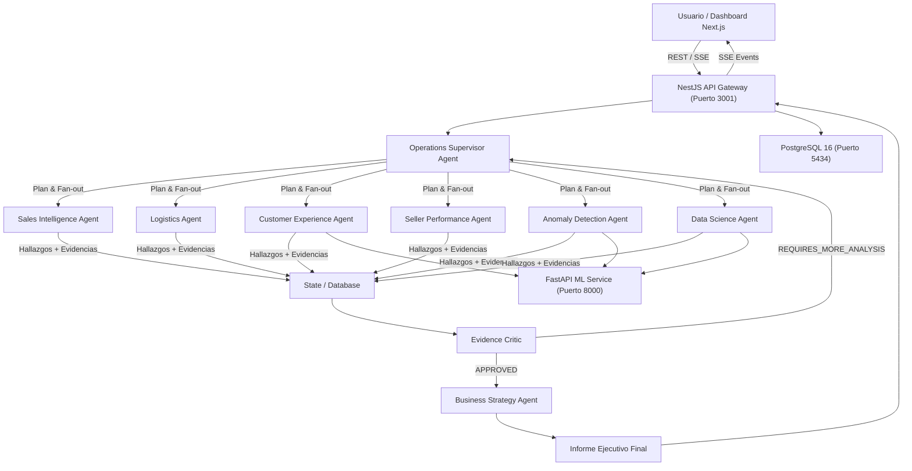

# Arquitectura de Sistema — CommerceOps AI

## Visión General

**CommerceOps AI** es una plataforma multiagente de inteligencia operacional diseñada para resolver preguntas complejas de comercio electrónico a partir de datos relacionales de marketplaces (dataset Olist con ~100.000 pedidos).

## Diagrama de Arquitectura

## Principio Central

> **Los agentes razonan, las herramientas calculan.**

Los LLMs no realizan cálculos numéricos mentalmente. Todas las cifras provienen de ejecuciones deterministas de SQL, agregaciones o modelos de Machine Learning versionados.
